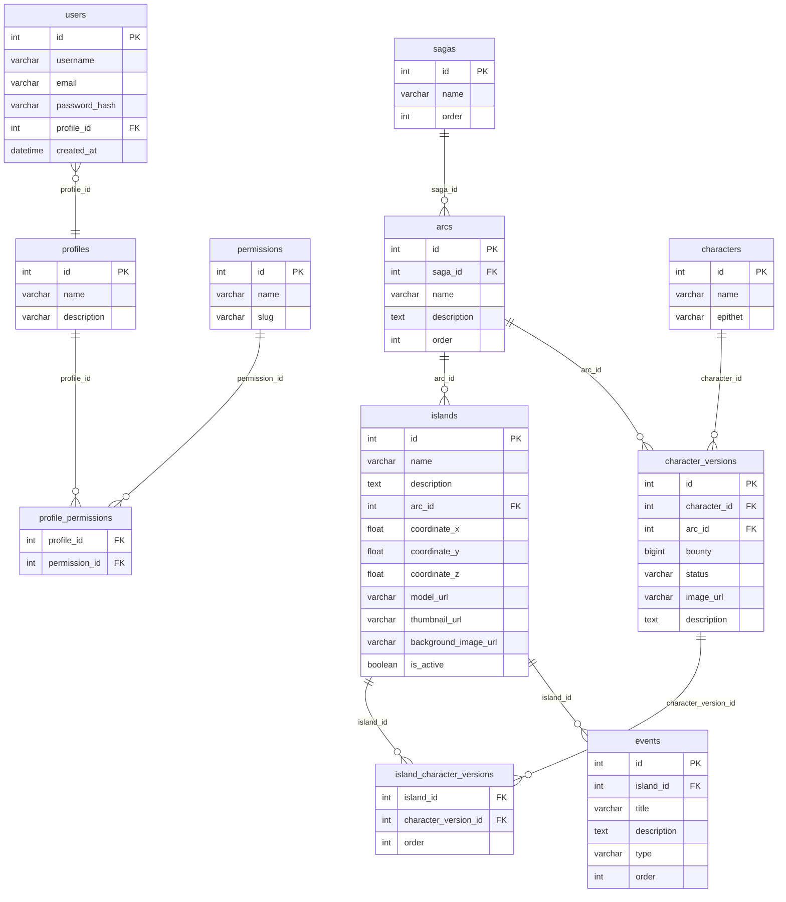

# 🏴‍☠️ Grand Line API: Project Overview & Blueprint

Este documento consolida toda a visão estratégica, requisitos técnicos e arquitetura do projeto **Grand Line API**. Ele serve como a "Bíblia" do desenvolvimento para o grupo.

---

## 🎯 Objetivo e Escopo
Desenvolver uma API robusta e de alta performance com o tema **One Piece**. A aplicação permitirá a exploração de um mapa interativo, gerenciamento de personagens, facções, Akuma no Mi, e um sistema interativo de Quizzes e Arcos, tudo protegido por um sistema rigoroso de **RBAC (Role-Based Access Control)**.

---

## 🛠️ Stack Tecnológica & Padrões
- **Framework**: Nest.js (v11)
- **Linguagem**: TypeScript (CommonJS / moduleResolution: node)
- **ORM**: Sequelize (com `sequelize-typescript`)
- **Banco de Dados**: PostgreSQL (Principal)
- **Documentação**: Swagger / OpenAPI (Obrigatório)
- **Arquitetura**: Vertical/Modular com padrão **CQRS** (Command Query Responsibility Segregation).
- **Padrão de Nomes**: Rico em semântica, separando claramente conceitos de Coleção (Plural) e Entidade/Payload (Singular).

---

## 📏 Padrão de Nomenclatura (Singular vs Plural)

Para manter a consistência em +60 endpoints, adotamos o seguinte padrão rigoroso:

| Categoria | Padrão | Exemplo | Motivo |
|---|---|---|---|
| **Módulo** | Plural | `UsersModule` | Contêiner de toda a funcionalidade. |
| **Controller** | Plural | `UsersController` | Gerencia a coleção de recursos. |
| **Service** | Plural | `UsersService` | Orquestra operações sobre o domínio. |
| **Model** | Singular | `User` | Representa uma única linha no banco. |
| **DTO** | Singular | `UserFilterDto` | Representa o conceito do payload/filtro. |
| **Command** | Singular | `CreateUserCommand` | Uma ação específica (geralmente singular). |
| **Query** | Plural/Sing. | `GetUsersQuery` | Plural se retornar lista, Singular se retornar um. |
| **Arquivo** | kebab-case | `user-filter.dto.ts` | Segue o nome da classe. |

---

## 📋 Requisitos Obrigatórios (Trabalho Acadêmico)
- [ ] **Endpoints**: Mínimo de 60 endpoints implementados.
- [ ] **Documentação**: Swagger completo e obrigatório.
- [ ] **Listagem**: Todos os endpoints de listagem devem ter **Paginação** e pelo menos **2 Filtros**.
- [ ] **Segurança**: Autenticação e controle de acesso via **Perfil e Permissão**.
- [ ] **Regras de Negócio**: Mínimo de 10 regras complexas (não apenas validações de campo).
- [ ] **Persistência**: Uso obrigatório de **Migrations** e **Seeds**.

---

## 🏗️ Arquitetura: Foco em CQRS
Para garantir escalabilidade e aprendizado técnico, o projeto adotará **CQRS** logo no primeiro commit:
- **Commands**: Responsáveis por mutações de estado (Create, Update, Delete).
- **Queries**: Responsáveis por consultas otimizadas e leitura de dados.
- **Vertical Slice**: A estrutura de pastas será organizada por funcionalidade (entidade), mantendo comandos, queries, modelos e controllers próximos.

---

## 📊 Diagrama de Entidade-Relacionamento (ERD)

> [!NOTE]
> **Modelo de Auditoria e Soft Delete**: Para manter o diagrama visualmente limpo, as colunas de controle (`id`, `createdAt`, `updatedAt` e `deletedAt`) foram omitidas ou simplificadas. No entanto, todas as entidades principais do sistema implementam obrigatoriamente esse quarteto de campos para garantir rastreabilidade total e suporte ao **Soft Delete** nativo do Sequelize.



---

## 🗺️ Roadmap Global (TODO List)

### Fase 1: Fundação & Segurança (Prioridade Alta)
- [x] **Configuração CQRS**: Setup do `@nestjs/cqrs` e organização da pasta `src/shared`.
- [x] **Módulo de RBAC (CQRS)**:
    - [x] CRUD de `PROFILES` (Commands/Queries).
    - [x] CRUD de `PERMISSIONS` (Commands/Queries).
    - [x] Gerenciamento de `PROFILE_PERMISSIONS`.
- [x] **Autenticação**:
    - [x] Registro e Login de `USERS`.
    - [x] Implementação de **Guards** baseados em Roles e Permissions.
    - [x] Integração com JWT (ESM compatible).

### Fase 2: Núcleo Geográfico & Conteúdo
- [ ] **CRUD de Regiões e Ilhas**: Listagem com filtros de clima e região.
- [ ] **Enciclopédia**: Implementação de Sagas, Arcos e Personagens.
- [ ] **Sistema de Akuma no Mi**: Regra de negócio: apenas um usuário por fruto.

### Fase 3: Interatividade & Gamificação
- [ ] **Sistema de Exploração**: Desbloqueio de ilhas baseado em quizzes.
- [ ] **Quizzes & Respostas**: Implementação de lógica de pontuação.

### Fase 4: Polimento & Entrega
- [ ] **Swagger**: Documentação exaustiva de todos os endpoints.
- [ ] **Performance**: Implementação de Cache em endpoints de listagem de ilhas/personagens.
- [ ] **Business Rules**: Refinamento das 10 regras de negócio complexas em PDF.

---

## 📂 Padrão de Estrutura Vertical (Exemplo: Users)
```text
src/users/
├── commands/
│   ├── handlers/
│   │   └── create-user.handler.ts  ← lógica de negócio (CommandHandler)
│   └── impl/
│       └── create-user.command.ts  ← payload do comando tipado com DTO
├── queries/
│   ├── handlers/
│   │   └── get-users.handler.ts    ← lógica de consulta (QueryHandler)
│   └── impl/
│       └── get-users.query.ts      ← payload da query tipado com DTO
├── dtos/
│   ├── create-user.dto.ts          ← valida @Body() e documenta no Swagger
│   └── user-filter.dto.ts          ← valida @Query() com filtros e paginação
├── models/
│   └── user.model.ts               ← entidade Sequelize (mapeamento da tabela)
├── users.controller.ts             ← recebe HTTP, delega ao Service
├── users.service.ts                ← orquestra CommandBus e QueryBus
└── users.module.ts                 ← registra tudo no NestJS
```

### Fluxo da requisição
```
Request → DTO (valida) → Controller → Service → Bus → Handler → Model (Sequelize)
```

### Responsabilidade de cada camada
| Arquivo | Responsabilidade |
|---|---|
| `dto/create` | Validar e documentar os dados de entrada do POST (`@Body`) |
| `dto/filter` | Validar e documentar os filtros e paginação do GET (`@Query`) |
| `controller` | Receber a requisição HTTP tipada com DTO e chamar o Service |
| `service` | Instanciar Commands/Queries com o DTO e despachar para o Bus |
| `command/impl` | Carregar o DTO tipado para dentro do fluxo CQRS |
| `command/handler` | Executar a lógica de escrita usando o Model |
| `query/impl` | Carregar os filtros tipados para dentro do fluxo CQRS |
| `query/handler` | Executar a consulta otimizada usando o Model |
| `model` | Mapear a entidade para a tabela do PostgreSQL |
| `module` | Registrar controllers, providers e models do módulo |

---

## 🔁 Como criar um novo módulo (passo a passo)

Siga sempre esta ordem ao implementar uma nova entidade. Use `src/users/` como referência de implementação real.

---

### 1. Model (`models/xxx.model.ts`)
Mapeia a entidade para a tabela do banco. Use `!` nas propriedades para evitar erros de inicialização do TypeScript com o Sequelize:
```ts
import { Table, Column, Model, DataType, PrimaryKey, AutoIncrement, AllowNull, Unique } from 'sequelize-typescript';

@Table({ tableName: 'NomeDaTabela' })
export class Xxx extends Model {
  @PrimaryKey @AutoIncrement @Column(DataType.INTEGER) id!: number;

  @Unique @AllowNull(false) @Column(DataType.STRING) nome!: string;

  // Relacionamento (FK):
  // @ForeignKey(() => Yyy) @AllowNull(false) @Column(DataType.INTEGER) yyy_id!: number;
  // @BelongsTo(() => Yyy) yyy!: Yyy;
}
```

---

### 2. DTOs (`dtos/`)
DTOs são **obrigatórios** por dois motivos: validação dos dados de entrada e documentação automática do Swagger.

#### `dtos/create-xxx.dto.ts` — usado no `@Body()` do POST
```ts
import { ApiProperty } from '@nestjs/swagger';
import { IsString, IsNotEmpty, IsEmail, MinLength } from 'class-validator';

export class CreateXxxDto {
  @ApiProperty({ example: 'exemplo', description: 'Descrição do campo' })
  @IsString() @IsNotEmpty()
  nome: string;

  // Use o decorator de validação adequado para cada tipo:
  // @IsEmail()          → para e-mails
  // @MinLength(6)       → para senhas
  // @IsInt()            → para números inteiros
  // @IsOptional()       → para campos que não são obrigatórios
}
```

#### `dtos/xxx-filter.dto.ts` — usado no `@Query()` do GET
Sempre inclua **paginação** (`page`, `limit`) e pelo menos **2 filtros**:
```ts
import { ApiPropertyOptional } from '@nestjs/swagger';
import { IsOptional, IsString, IsInt, Min } from 'class-validator';
import { Type } from 'class-transformer';

export class XxxFilterDto {
  @ApiPropertyOptional({ example: 'valor', description: 'Filtro 1' })
  @IsOptional() @IsString()
  filtro1?: string;

  @ApiPropertyOptional({ example: 'valor', description: 'Filtro 2' })
  @IsOptional() @IsString()
  filtro2?: string;

  @ApiPropertyOptional({ example: 1, default: 1, description: 'Página atual' })
  @IsOptional() @Type(() => Number) @IsInt() @Min(1)
  page?: number = 1;

  @ApiPropertyOptional({ example: 10, default: 10, description: 'Itens por página' })
  @IsOptional() @Type(() => Number) @IsInt() @Min(1)
  limit?: number = 10;
}
```

> **Referência real:** `src/users/dtos/create-user.dto.ts` e `src/users/dtos/user-filter.dto.ts`

---

### 3. Command — payload (`commands/impl/create-xxx.command.ts`)
Carrega os dados tipados do DTO para dentro do fluxo CQRS:
```ts
import { CreateXxxDto } from '../../dtos/create-xxx.dto';

export class CreateXxxCommand {
  constructor(public readonly data: CreateXxxDto) {}
}
```

---

### 4. Command — handler (`commands/handlers/create-xxx.handler.ts`)
Executa a lógica de negócio. Use `private readonly` na injeção:
```ts
import { CommandHandler, ICommandHandler } from '@nestjs/cqrs';
import { InjectModel } from '@nestjs/sequelize';
import { CreateXxxCommand } from '../impl/create-xxx.command';
import { Xxx } from '../../models/xxx.model';

@CommandHandler(CreateXxxCommand)
export class CreateXxxHandler implements ICommandHandler<CreateXxxCommand> {
  constructor(
    @InjectModel(Xxx)
    private readonly xxxModel: typeof Xxx,
  ) {}

  async execute(command: CreateXxxCommand) {
    return this.xxxModel.create(command.data as any);
  }
}
```

---

### 5. Query — payload (`queries/impl/get-xxx.query.ts`)
Carrega os filtros tipados do DTO:
```ts
import { XxxFilterDto } from '../../dtos/xxx-filter.dto';

export class GetXxxQuery {
  constructor(public readonly filters: XxxFilterDto) {}
}
```

---

### 6. Query — handler (`queries/handlers/get-xxx.handler.ts`)
Executa a consulta com paginação e filtros. Use `private readonly`:
```ts
import { IQueryHandler, QueryHandler } from '@nestjs/cqrs';
import { InjectModel } from '@nestjs/sequelize';
import { Op } from 'sequelize';
import { GetXxxQuery } from '../impl/get-xxx.query';
import { Xxx } from '../../models/xxx.model';

@QueryHandler(GetXxxQuery)
export class GetXxxHandler implements IQueryHandler<GetXxxQuery> {
  constructor(
    @InjectModel(Xxx)
    private readonly xxxModel: typeof Xxx,
  ) {}

  async execute(query: GetXxxQuery) {
    const { page = 1, limit = 10, filtro1, filtro2 } = query.filters;
    const offset = (page - 1) * limit;

    const where: any = {};
    if (filtro1) where.campo1 = { [Op.iLike]: `%${filtro1}%` };
    if (filtro2) where.campo2 = { [Op.iLike]: `%${filtro2}%` };

    return this.xxxModel.findAndCountAll({
      where,
      limit: Number(limit),
      offset: Number(offset),
    });
  }
}
```

---

### 7. Service (`xxx.service.ts`)
Orquestra os buses. Use `private readonly`. Não contém lógica de negócio:
```ts
import { Injectable } from '@nestjs/common';
import { CommandBus, QueryBus } from '@nestjs/cqrs';
import { CreateXxxCommand } from './commands/impl/create-xxx.command';
import { GetXxxQuery } from './queries/impl/get-xxx.query';
import { CreateXxxDto } from './dtos/create-xxx.dto';
import { XxxFilterDto } from './dtos/xxx-filter.dto';

@Injectable()
export class XxxService {
  constructor(
    private readonly commandBus: CommandBus,
    private readonly queryBus: QueryBus,
  ) {}

  create(data: CreateXxxDto) {
    return this.commandBus.execute(new CreateXxxCommand(data));
  }

  findAll(filters: XxxFilterDto) {
    return this.queryBus.execute(new GetXxxQuery(filters));
  }
}
```

---

### 8. Controller (`xxx.controller.ts`)
Recebe a requisição HTTP e delega ao Service. Use os DTOs no `@Body()` e `@Query()`:
```ts
import { Controller, Post, Get, Body, Query } from '@nestjs/common';
import { ApiTags, ApiOperation } from '@nestjs/swagger';
import { XxxService } from './xxx.service';
import { CreateXxxDto } from './dtos/create-xxx.dto';
import { XxxFilterDto } from './dtos/xxx-filter.dto';

@ApiTags('xxx')
@Controller('xxx')
export class XxxController {
  constructor(private readonly xxxService: XxxService) {}

  @ApiOperation({ summary: 'Criar um novo xxx' })
  @Post()
  create(@Body() body: CreateXxxDto) {
    return this.xxxService.create(body);
  }

  @ApiOperation({ summary: 'Listar todos os xxx com filtros e paginação' })
  @Get()
  findAll(@Query() params: XxxFilterDto) {
    return this.xxxService.findAll(params);
  }
}
```

---

### 9. Module (`xxx.module.ts`)
Registra tudo no NestJS. DTOs **não** precisam ser registrados:
```ts
import { Module } from '@nestjs/common';
import { CqrsModule } from '@nestjs/cqrs';
import { SequelizeModule } from '@nestjs/sequelize';
import { Xxx } from './models/xxx.model';
import { XxxService } from './xxx.service';
import { XxxController } from './xxx.controller';
import { CreateXxxHandler } from './commands/handlers/create-xxx.handler';
import { GetXxxHandler } from './queries/handlers/get-xxx.handler';

@Module({
  imports: [CqrsModule, SequelizeModule.forFeature([Xxx])],
  controllers: [XxxController],
  providers: [XxxService, CreateXxxHandler, GetXxxHandler],
})
export class XxxModule {}
```

> Após criar o módulo, importe-o em `src/app.module.ts`.

---

## 🔮 Evolução Futura: CQRS Nível 3 (Bancos Separados)

### Pensamento do projeto

A arquitetura atual implementa o **CQRS Estrutural (Nível 1)**: Commands e Queries são separados em código, usam buses distintos e têm handlers independentes, mas ambos leem e escrevem no **mesmo banco PostgreSQL**.

Essa escolha foi intencional. O objetivo é construir toda a API nesse padrão e, futuramente, evoluir para o **CQRS Nível 3**, onde o banco de escrita e o banco de leitura são instâncias separadas, sincronizadas por eventos. A estrutura atual foi desenhada para que essa evolução seja possível sem reescrever o código já feito.

---

### Os três níveis de CQRS

| Nível | O que é | O que temos hoje |
|---|---|---|
| **1 — Estrutural** | Commands e Queries separados em código, mesmo banco | ✅ Implementado |
| **2 — Queries otimizadas** | Mesmo banco, mas leituras feitas com SQL puro em vez de ORM | Pode ser adicionado gradualmente |
| **3 — Bancos separados** | Banco de escrita (write DB) + banco de leitura (read DB), sincronizados por eventos | 🎯 Meta futura |

---

### O que precisará mudar para o Nível 3

A grande vantagem dessa arquitetura é que **a maioria das camadas não muda**. A separação que já existe hoje entre Commands e Queries é exatamente o que torna essa evolução cirúrgica.

| Camada | Impacto | Explicação |
|---|---|---|
| `Controller` | ❌ Nenhum | O controller só chama o Service. Não sabe nada sobre banco de dados. |
| `Service` | ❌ Nenhum | O service só despacha para o bus. Completamente agnóstico ao banco. |
| `DTOs` | ❌ Nenhum | Apenas definem a forma dos dados. Não dependem de infraestrutura. |
| `Command/impl` | ❌ Nenhum | São classes simples de payload. Não mudam. |
| `Query/impl` | ❌ Nenhum | São classes simples de payload. Não mudam. |
| `Command Handler` | ⚠️ Mínimo | Adicionar uma linha para publicar um evento após gravar no banco. A lógica de escrita permanece igual. |
| `Query Handler` | ✅ Muda | É a principal mudança: trocar a fonte de dados do banco de escrita para o banco de leitura. A lógica de filtros e paginação permanece igual. |
| `Module` | ✅ Muda | Registrar os novos `EventHandlers` e configurar a conexão com o segundo banco. |
| `AppModule` | ✅ Muda | Adicionar a segunda conexão Sequelize apontando para o banco de leitura. |

---

### Como a sincronização funcionaria

Quando o banco de escrita recebe uma operação de criação ou atualização, o sistema precisa replicar essa mudança para o banco de leitura. Isso é feito por eventos, seguindo o fluxo abaixo:

```
Command Handler grava no banco de escrita
  → publica um evento (ex: UserCreatedEvent)
    → EventHandler recebe o evento
      → EventHandler grava/atualiza no banco de leitura
```

O banco de leitura pode ser uma réplica do PostgreSQL, um banco separado, ou até uma tecnologia diferente otimizada para consultas. Os `QueryHandlers` passam a consultar apenas esse banco de leitura, que é mais rápido por não ter contenção com as operações de escrita.

---

### Por que a estrutura atual já está preparada

A separação entre `commands/` e `queries/` não é apenas organizacional — ela é a garantia técnica de que, quando chegar o momento, cada lado pode evoluir de forma independente. Nenhum handler de escrita sabe que existe um handler de leitura, e vice-versa. O bus é o único elo entre eles, e ele permanece idêntico nos dois cenários.

Em resumo: **todo o código que você criar agora nesse padrão não precisará ser reescrito para suportar o Nível 3 — apenas a camada de handlers de leitura e a infraestrutura de banco será adicionada por cima do que já existe.**
